# Architecture: TerrestraX

> Auto-generated by [ArchEx](https://github.com/archex) on 2026-02-14 02:40

> Analyzed from: `E:\Vault\TheUnknownDimension\TerrestraX`

## Overview

| Metric | Value |
|--------|-------|
| Files | 17 |
| Lines of Code | 854 |
| Functions/Methods | 41 |
| Classes | 14 |
| Modules | 16 |
| Languages | **python**: 15 | **c**: 2 |

**Components**: 8 detected clusters

## Module Contracts

*Each module's responsibility, dependencies, and health at a glance.*

### `core.dtypes`
- **File**: `core/dtypes.py`
- **Size**: 40 LOC | 0 functions | 4 classes
- **Depended on by**: `core.kinematics_symbolic_rev02`, `core.pose`, `robots.config_rev01`, `robots.config_temp`, `robots.rconfig`
- **Metrics**: I=0.0 | LCOM4=21 | Ca=5 Ce=0

### `controllers.gamepad_debug_controller.gamepad_debug_controller`
- **File**: `controllers/gamepad_debug_controller/gamepad_debug_controller.py`
- **Size**: 41 LOC | 1 functions | 0 classes
- **Depends on**: `controllers.connectors.hud`, `controllers.connectors.webots_joystick`, `os`, `sys`
- **Metrics**: I=1.0 | LCOM4=2 | Ca=0 Ce=4

### `controllers.spider_static_controller.spider_static_controller`
- **File**: `controllers/spider_static_controller/spider_static_controller.py`
- **Size**: 80 LOC | 2 functions | 0 classes
- **Depends on**: `controllers.connectors.hud`, `os`, `sys`
- **Metrics**: I=1.0 | LCOM4=12 | Ca=0 Ce=3

### `controllers.connectors.hud`
- **File**: `controllers/connectors/hud.py`
- **Size**: 85 LOC | 6 functions | 4 classes
- **Depended on by**: `controllers.gamepad_debug_controller.gamepad_debug_controller`, `controllers.spider_static_controller.spider_static_controller`
- **Metrics**: I=0.0 | LCOM4=10 | Ca=2 Ce=0

### `controllers.spider_static.spider_core`
- **File**: `controllers/spider_static/spider_core.h`
- **Size**: 9 LOC | 1 functions | 0 classes
- **Depends on**: `math.h`, `spider_core.h`
- **Metrics**: I=1.0 | LCOM4=1 | Ca=0 Ce=2

### `controllers.connectors.webots_joystick`
- **File**: `controllers/connectors/webots_joystick.py`
- **Size**: 121 LOC | 7 functions | 6 classes
- **Depended on by**: `controllers.gamepad_debug_controller.gamepad_debug_controller`
- **Metrics**: I=0.0 | LCOM4=17 | Ca=1 Ce=0

### `robots.rconfig`
- **File**: `robots/rconfig.py`
- **Size**: 40 LOC | 1 functions | 0 classes
- **Depends on**: `core.dtypes`
- **Metrics**: I=1.0 | LCOM4=1 | Ca=0 Ce=1

### `core.kinematics_symbolic_rev02`
- **File**: `core/kinematics_symbolic_rev02.py`
- **Size**: 126 LOC | 9 functions | 0 classes
- **Depends on**: `core.dtypes`
- **Metrics**: I=1.0 | LCOM4=1 | Ca=0 Ce=1

### `core.pose`
- **File**: `core/pose.py`
- **Size**: 21 LOC | 3 functions | 0 classes
- **Depends on**: `core.dtypes`
- **Metrics**: I=1.0 | LCOM4=5 | Ca=0 Ce=1

### `robots.config_temp`
- **File**: `robots/config_temp.py`
- **Size**: 76 LOC | 3 functions | 0 classes
- **Depends on**: `core.dtypes`
- **Metrics**: I=1.0 | LCOM4=10 | Ca=0 Ce=1

### `controllers.spider_static_test_rev01_mk01.spider_static_test_rev01_mk01`
- **File**: `controllers/spider_static_test_rev01_mk01/spider_static_test_rev01_mk01.py`
- **Size**: 28 LOC | 0 functions | 0 classes
- **Depends on**: `math`
- **Metrics**: I=1.0 | LCOM4=4 | Ca=0 Ce=1

### `robots.config_rev01`
- **File**: `robots/config_rev01.py`
- **Size**: 20 LOC | 1 functions | 0 classes
- **Depends on**: `core.dtypes`
- **Metrics**: I=1.0 | LCOM4=1 | Ca=0 Ce=1

### `core.kinematics`
- **File**: `core/kinematics.py`
- **Size**: 70 LOC | 4 functions | 0 classes
- **Metrics**: I=0.0 | LCOM4=2 | Ca=0 Ce=0

### `core.trajectory`
- **File**: `core/trajectory.py`
- **Size**: 17 LOC | 0 functions | 0 classes
- **Metrics**: I=0.0 | LCOM4=1 | Ca=0 Ce=0

### `core.kinematics_rev01`
- **File**: `core/kinematics_rev01.py`
- **Size**: 61 LOC | 3 functions | 0 classes
- **Metrics**: I=0.0 | LCOM4=1 | Ca=0 Ce=0

### `robots.model`
- **File**: `robots/model.py`
- **Size**: 0 LOC | 0 functions | 0 classes
- **Metrics**: I=0.0 | LCOM4=1 | Ca=0 Ce=0

## Entry Points

*Start reading here to understand the project.*

- **controllers.gamepad_debug_controller.gamepad_debug_controller.main** (`controllers/gamepad_debug_controller/gamepad_debug_controller.py`) L17 — Function 'main' is likely an entry point
- **robots.rconfig** (`robots/rconfig.py`) — Top-level module (no dependents)
- **controllers.spider_static_controller.spider_static_controller** (`controllers/spider_static_controller/spider_static_controller.py`) — Top-level module (no dependents)
- **core.kinematics_symbolic_rev02** (`core/kinematics_symbolic_rev02.py`) — Top-level module (no dependents)
- **core.pose** (`core/pose.py`) — Top-level module (no dependents)
- **robots.config_temp** (`robots/config_temp.py`) — Top-level module (no dependents)
- **controllers.gamepad_debug_controller.gamepad_debug_controller** (`controllers/gamepad_debug_controller/gamepad_debug_controller.py`) — Top-level module (no dependents)
- **controllers.spider_static.spider_core** (`controllers/spider_static/spider_core.h`) — Top-level module (no dependents)
- **controllers.spider_static_test_rev01_mk01.spider_static_test_rev01_mk01** (`controllers/spider_static_test_rev01_mk01/spider_static_test_rev01_mk01.py`) — Top-level module (no dependents)
- **robots.config_rev01** (`robots/config_rev01.py`) — Top-level module (no dependents)

### Most Important Modules (by PageRank)

1. `core.dtypes` (score: 0.25)
2. `controllers.gamepad_debug_controller.gamepad_debug_controller` (score: 0.2)
3. `controllers.spider_static_controller.spider_static_controller` (score: 0.15)
4. `controllers.connectors.hud` (score: 0.1)
5. `os` (score: 0.1)
6. `sys` (score: 0.1)
7. `controllers.spider_static.spider_core` (score: 0.1)
8. `controllers.connectors.webots_joystick` (score: 0.05)
9. `math` (score: 0.05)
10. `robots.rconfig` (score: 0.05)

## Dependency Flow

```mermaid
graph TD
    M0["hud"]
    M1["webots_joystick"]
    M2["gamepad_debug_controller"]
    M3["spider_core"]
    M4["spider_static_controller"]
    M5["spider_static_test_rev01_mk01"]
    M6["dtypes"]
    M7["kinematics"]
    M8["kinematics_rev01"]
    M9["kinematics_symbolic_rev02"]
    M10["pose"]
    M11["trajectory"]
    M12["math"]
    M13["h"]
    M14["os"]
    M15["config_rev01"]
    M16["config_temp"]
    M17["model"]
    M18["rconfig"]
    M19["h"]
    M20["sys"]
    M18 ==>|2| M6
    M4 --> M14
    M4 --> M20
    M4 --> M0
    M9 --> M6
    M10 ==>|2| M6
    M16 --> M6
    M2 --> M14
    M2 --> M20
    M2 ==>|2| M1
    M2 ==>|2| M0
    M3 --> M19
    M3 --> M13
    M5 --> M12
    M15 ==>|2| M6
```

## Conventions

*Auto-detected coding patterns. Follow these for consistency.*

### Naming

| Symbol Type | Convention | Consistency |
|-------------|-----------|-------------|
| class | `PascalCase` | 100% |
| variable | `lowercase` | 56% |
| method | `lowercase` | 46% |
| constant | `UPPER_SNAKE_CASE` | 100% |
| function | `snake_case` | 79% |

### Detected Patterns

- **@dataclass** — 'dataclass' decorator used 9 times
- **@staticmethod** — 'staticmethod' decorator used 4 times
- **@dataclass(frozen=True)** — 'dataclass(frozen=True)' decorator used 2 times

### Testing

- Framework: unknown
- Test files: 1
- Test functions: 0
- Test directories: `controllers/spider_static_test_rev01_mk01`

## Health Dashboard

| Module | LOC | Coupling (Ca/Ce) | Instability | Cohesion | Status |
|--------|-----|-----------------|-------------|----------|--------|
| `hud` | 85 | 2/0 | 0.0 | low | 🟡 low cohesion |
| `webots_joystick` | 121 | 1/0 | 0.0 | low | 🟡 low cohesion |
| `gamepad_debug_controller` | 41 | 0/4 | 1.0 | medium | 🟢 |
| `spider_core` | 9 | 0/2 | 1.0 | high | 🟢 |
| `spider_static_controller` | 80 | 0/3 | 1.0 | low | 🟡 low cohesion |
| `spider_static_test_rev01_mk01` | 28 | 0/1 | 1.0 | low | 🟢 |
| `dtypes` | 40 | 5/0 | 0.0 | low | 🟡 rigid |
| `kinematics` | 70 | 0/0 | 0.0 | medium | 🟢 |
| `kinematics_rev01` | 61 | 0/0 | 0.0 | high | 🟢 |
| `kinematics_symbolic_rev02` | 126 | 0/1 | 1.0 | high | 🟢 |
| `pose` | 21 | 0/1 | 1.0 | low | 🟢 |
| `trajectory` | 17 | 0/0 | 0.0 | high | 🟢 |
| `config_rev01` | 20 | 0/1 | 1.0 | high | 🟢 |
| `config_temp` | 76 | 0/1 | 1.0 | low | 🟡 low cohesion |
| `rconfig` | 40 | 0/1 | 1.0 | high | 🟢 |

## Symbol Reference

### `controllers.connectors.hud`

| Symbol | Kind | Line | Visibility |
|--------|------|------|------------|
| `HudConfig` | class | L8 | public |
| `device_name` | variable | L9 | public |
| `max_axes_shown` | variable | L10 | public |
| `max_buttons_shown` | variable | L11 | public |
| `GamepadHUD` | class | L14 | public |
| `__init__` | method | L17 | private |
| `_clamp01` | method | L24 | private |
| `_draw_axis_bar` | method | L27 | private |
| `update` | method | L37 | public |
| `PoseHudConfig` | class | L64 | public |
| `device_name` | variable | L65 | public |
| `PoseHUD` | class | L68 | public |
| `__init__` | method | L71 | private |
| `update` | method | L79 | public |

### `controllers.connectors.webots_joystick`

| Symbol | Kind | Line | Visibility |
|--------|------|------|------------|
| `TeleopCommand` | class | L11 | public |
| `vx` | variable | L12 | public |
| `vy` | variable | L13 | public |
| `wz` | variable | L14 | public |
| `estop` | variable | L15 | public |
| `JoystickState` | class | L19 | public |
| `axes` | variable | L20 | public |
| `buttons` | variable | L21 | public |
| `AxisMap` | class | L25 | public |
| `lx` | variable | L26 | public |
| `ly` | variable | L27 | public |
| `rx` | variable | L28 | public |
| `ry` | variable | L29 | public |
| `ButtonMap` | class | L33 | public |
| `estop` | variable | L34 | public |
| `FilterConfig` | class | L38 | public |
| `deadzone` | variable | L39 | public |
| `shape_exp` | variable | L40 | public |
| `normalize_large_axes` | variable | L41 | public |
| `WebotsJoystick` | class | L44 | public |
| `__init__` | method | L45 | private |
| `_deadzone` | method | L67 | private |
| `_signed_pow` | method | L75 | private |
| `_clamp` | method | L81 | private |
| `read_state` | method | L84 | public |
| `to_teleop` | method | L99 | public |
| `read` | method | L119 | public |

### `controllers.gamepad_debug_controller.gamepad_debug_controller`

| Symbol | Kind | Line | Visibility |
|--------|------|------|------------|
| `CONTROLLERS_DIR` | constant | L9 | public |
| `main` | function | L17 | public |

### `controllers.spider_static.spider_core`

| Symbol | Kind | Line | Visibility |
|--------|------|------|------------|
| `spider_compute_joint_angles` | function | L3 | public |

### `controllers.spider_static_controller.spider_static_controller`

| Symbol | Kind | Line | Visibility |
|--------|------|------|------------|
| `ROOT_DIR` | constant | L8 | public |
| `TIME_STEP` | constant | L15 | public |
| `robot` | variable | L17 | public |
| `keyboard` | variable | L18 | public |
| `j0` | variable | L22 | public |
| `j1` | variable | L23 | public |
| `j2` | variable | L24 | public |
| `POSE_NAMES` | constant | L30 | public |
| `pose_index` | variable | L34 | public |
| `pose_changed` | variable | L35 | public |
| `apply_pose` | function | L45 | public |
| `draw_ui` | function | L51 | public |

### `controllers.spider_static_test_rev01_mk01.spider_static_test_rev01_mk01`

| Symbol | Kind | Line | Visibility |
|--------|------|------|------------|
| `TIME_STEP` | constant | L4 | public |
| `robot` | variable | L6 | public |
| `coxa_motor` | variable | L10 | public |
| `t` | variable | L21 | public |

### `core.dtypes`

| Symbol | Kind | Line | Visibility |
|--------|------|------|------------|
| `NpSym` | variable | L7 | public |
| `Vec3` | variable | L9 | public |
| `JointVec` | variable | L10 | public |
| `DHparam` | class | L13 | public |
| `a` | variable | L15 | public |
| `alpha` | variable | L16 | public |
| `d` | variable | L17 | public |
| `theta_offset` | variable | L18 | public |
| `joint_type` | variable | L19 | public |
| `isvirtual` | variable | L20 | public |
| `ChainParams` | class | L23 | public |
| `dh_params` | variable | L25 | public |
| `ChainPose` | class | L28 | public |
| `coxa` | variable | L30 | public |
| `femur` | variable | L31 | public |
| `tibia` | variable | L32 | public |
| `RobotPose` | class | L35 | public |
| `FL` | constant | L37 | public |
| `FR` | constant | L38 | public |
| `RL` | constant | L39 | public |
| `RR` | constant | L40 | public |

### `core.kinematics`

| Symbol | Kind | Line | Visibility |
|--------|------|------|------------|
| `forward_kinematics` | variable | L6 | public |
| `dh_transform` | function | L8 | public |
| `chain_kin` | function | L39 | public |
| `chain_footpoint` | function | L58 | public |
| `chain_jacobian` | function | L64 | public |

### `core.kinematics_rev01`

| Symbol | Kind | Line | Visibility |
|--------|------|------|------------|
| `dh_transform` | function | L5 | public |
| `chain_kin` | function | L32 | public |
| `chain_footpoint` | function | L55 | public |

### `core.kinematics_symbolic_rev02`

| Symbol | Kind | Line | Visibility |
|--------|------|------|------------|
| `_sympy` | function | L14 | private |
| `make_symbolic_q` | function | L21 | public |
| `dh_transform_sym` | function | L28 | public |
| `chain_kin_sym` | function | L59 | public |
| `chain_footpoint_sym` | function | L76 | public |
| `jacobian_footpoint_sym` | function | L82 | public |
| `lambdify_chain_footpoint` | function | L89 | public |
| `lambdify_chain_jacobian` | function | L96 | public |
| `with_symbolic_params` | function | L103 | public |

### `core.pose`

| Symbol | Kind | Line | Visibility |
|--------|------|------|------------|
| `pose_to_joint` | function | L5 | public |
| `joint_to_pose` | function | L8 | public |
| `pose_to_robotpose` | function | L11 | public |
| `LEG_POSES` | constant | L14 | public |
| `ROBOT_POSES` | constant | L21 | public |

### `robots.config_rev01`

| Symbol | Kind | Line | Visibility |
|--------|------|------|------------|
| `FL_chain` | function | L4 | public |

### `robots.config_temp`

| Symbol | Kind | Line | Visibility |
|--------|------|------|------------|
| `FL_chain_symbolic` | function | L1 | public |
| `FL_chain` | function | L10 | public |
| `dh_transform` | function | L30 | public |
| `T0_base` | variable | L45 | public |
| `T` | constant | L52 | public |
| `transforms` | variable | L53 | public |
| `T_ee` | variable | L61 | public |
| `p_ee` | variable | L62 | public |
| `joint_symbols` | variable | L65 | public |
| `jacobian_position` | variable | L66 | public |

### `robots.rconfig`

| Symbol | Kind | Line | Visibility |
|--------|------|------|------------|
| `FL_chain` | function | L5 | public |